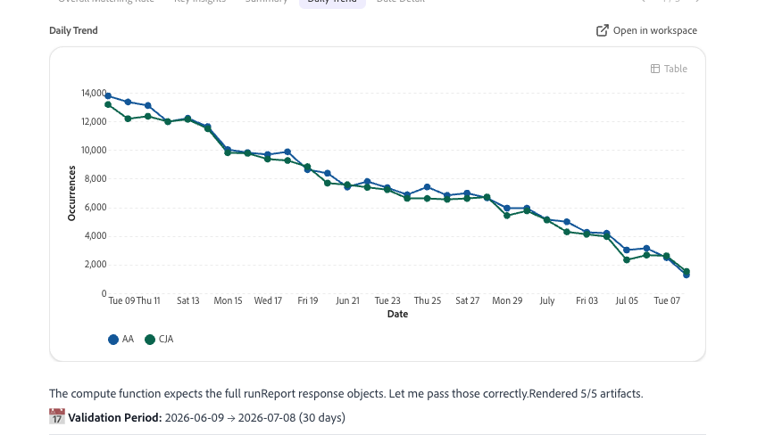
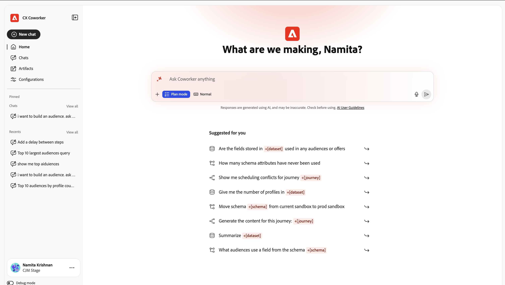

# Analizar datos con el chat de compañeros

La información de esta página proporciona información general sobre Adobe CX Enterprise Coworker Chat y cómo puede ayudarle a analizar los datos de su organización.

Coworker Chat permite a los equipos automatizar las tareas de productos de Adobe utilizando un lenguaje natural, convirtiendo rápidamente las ideas en acciones con una planificación flexible, habilidades personalizables y ejecución inteligente. Para obtener más información general sobre el Compañero de trabajo, consulte [Información general de CX Enterprise Coworker](/help/home.md).

>[!VIDEO](https://video.tv.adobe.com/v/3503519/?learn=on&enablevpops)

## Funcionamiento del análisis de datos

El chat de compañeros puede realizar análisis de datos avanzados que anteriormente solo eran posibles en Analysis Workspace. El chat de compañeros accede a los datos de sus vistas de datos de Customer Journey Analytics o grupos de informes de Adobe Analytics, lo que le permite explorar los datos y obtener respuestas con preguntas en lenguaje natural.

El chat de compañeros hereda los permisos de Customer Journey Analytics o Adobe Analytics. Solo puede acceder a las vistas de datos, los grupos de informes, las dimensiones, las métricas y los segmentos disponibles en Analysis Workspace.

Cuando crea una visualización en el chat de Coworker, puede abrirla en Analysis Workspace en cualquier momento para tener un mayor control manual.

## Respuestas rápidas y trabajo profundo

Puede utilizar el chat de Coworker de dos formas, en función del análisis que necesite:

* **Respuestas rápidas** - Haga una pregunta directa en un lenguaje sencillo y obtenga una respuesta inmediata. Los usuarios empresariales suelen utilizar el chat de Coworker de esta manera, y los analistas también lo utilizan cuando necesitan una respuesta rápida para una parte interesada.
* **Trabajo meticuloso**: mantenga una conversación prolongada y de varias vueltas con Coworker Chat para investigar un problema empresarial, descartar causas y llegar a una recomendación. Los analistas suelen utilizar este método para explorar los datos en profundidad antes de realizar una recomendación.

## Empezar a analizar en el chat de Coworker

Empiece describiendo lo que desea saber en un lenguaje sencillo. El chat de compañeros planifica el análisis, consulta las vistas de datos o los grupos de informes y crea visualizaciones y resúmenes.

Los siguientes casos de uso se agrupan por lo que desea lograr. Cada grupo enumera las funciones para las que es más adecuado.

### Rendimiento de medida

**Óptimo para:** Analista, usuario empresarial

| Ejemplo de uso | Función |
| --- | --- |
| [Analizar datos de Customer Journey Analytics y Adobe Analytics](/help/chat/use-cases/data-insights/analytics-chat.md)

 | Responde preguntas en lenguaje natural acerca de las vistas de datos o los grupos de informes, crea canales y otras visualizaciones y encuentra dónde abandonan los clientes. Puede abrir cualquier visualización en Analysis Workspace para un análisis más detallado.
**Mensaje de ejemplo:** &quot;Mostrarme vistas de página de los últimos 30 días&quot;

Para obtener más información, consulte [Introducción al análisis de datos con Coworker Chat](/help/chat/use-cases/data-insights/analytics-chat.md).
 |
| [Comparar rendimiento](#skills-and-limitations) | Comparar métricas en varios canales, períodos de tiempo o segmentos en paralelo.
**Mensaje de ejemplo:** &quot;Comparar ingresos por canal mes tras mes&quot;

Para obtener más información, consulte [Habilidades y limitaciones](#skills-and-limitations).
 |
| [Medir el rendimiento de la campaña](/help/chat/use-cases/overview.md#data-insights) | Consulte el rendimiento de las campañas, los canales y las propiedades web durante un periodo determinado.
**Mensaje de ejemplo:** &quot;¿Cómo funcionaron nuestras campañas web de Acrobat el mes pasado?&quot;

Para obtener más información, consulte [Información sobre los datos](/help/chat/use-cases/overview.md#data-insights) en Casos de uso de Chat del compañero de trabajo.
 |
| [Analizar canales](#skills-and-limitations) | Pase por los canales de conversión de varios pasos y vea la lista desplegable en cada fase.
**Mejor para:** Analista

**Mensaje de ejemplo:** &quot;Guíame a través del funnel de cierre de compra&quot;

Para obtener más información, consulte [Habilidades y limitaciones](#skills-and-limitations).
 |

### Descubra por qué cambiaron las métricas

**Mejor para:** Analista

| Ejemplo de uso | Función |
| --- | --- |
| [Explorar tendencias y causas básicas](/help/chat/use-cases/data-insights/root-cause-analysis.md)

 | Identifica las tendencias en los datos de Customer Journey Analytics y Adobe Analytics y los factores que impulsan los cambios en el rendimiento, sin consultas manuales.
**Mensaje de ejemplo:** &quot;¿Por qué cayeron las conversiones la semana pasada?&quot;

Para obtener más información, consulte [Customer Journey Analytics y compañeros](/help/chat/use-cases/data-insights/root-cause-analysis.md).
 |
| [Analizar tendencias y causas operativas](/help/chat/use-cases/overview.md#data-insights) | Consulte datos de series temporales históricas para audiencias, conjuntos de datos y recorridos, e identifique la causa del cambio.
**Óptimo para:** Administrador, Analista

**Mensaje de ejemplo:** &quot;Mostrarme las tendencias de tamaño de audiencia durante los últimos 90 días&quot;

Para obtener más información, consulte [Información sobre los datos](/help/chat/use-cases/overview.md#data-insights) en Casos de uso de Chat del compañero de trabajo.
 |

### Predecir el rendimiento futuro

**Mejor para:** Analista

| Ejemplo de uso | Función |
| --- | --- |
| [Métricas de pronóstico](#skills-and-limitations) | Proyecte valores de métricas futuras a partir de datos históricos de Customer Journey Analytics o Adobe Analytics, como si está en el camino correcto para alcanzar un objetivo de ingresos.
**Mensaje de ejemplo:** &quot;Sesiones de previsión para los próximos 30 días&quot;

Para obtener más información, consulte [Habilidades y limitaciones](#skills-and-limitations).
 |

### Compartir perspectivas con las partes interesadas

**Óptimo para:** Analista, usuario empresarial

| Ejemplo de uso | Función |
| --- | --- |
| [Crear resúmenes ejecutivos y resúmenes de KPI](#skills-and-limitations) | Produzca resúmenes de rendimiento, recomendaciones y descripciones de diapositivas preparados para las partes interesadas.
**Mensaje de ejemplo:** &quot;Dame un resumen ejecutivo del mes pasado&quot;

Para obtener más información, consulte [Habilidades y limitaciones](#skills-and-limitations).
 |

### Planifique su implementación o actualización

**Óptimo para:** Administrador

| Ejemplo de uso | Función |
| --- | --- |
| [Planifique su implementación](/help/chat/use-cases/data-insights/implementation-guide.md)

 | Crea un plan personalizado paso a paso para implementar Customer Journey Analytics, actualizar desde Adobe Analytics o configurar la recopilación de Content Analytics, Marketing Campaign Analytics o medios de streaming en Edge. Los planes incluyen detalles como propietarios, estimaciones de esfuerzo, dependencias y pasos de validación.
**Mensaje de ejemplo:** &quot;Ayúdeme a planificar la implementación de Customer Journey Analytics&quot;

Para obtener más información, consulte [Planificar su implementación con el Compañero de trabajo](/help/chat/use-cases/data-insights/implementation-guide.md).
 |
| [Generar una lista de comprobación de implementación](/help/chat/use-cases/data-insights/intelligent-checklist.md)

 | Convierte el plan de implementación de Customer Journey Analytics en una lista de comprobación en Proyectos de compañeros, donde su equipo puede asignar pasos, rastrear el estado y agregar puertas de aprobación.
Para obtener más información, consulte [Generar una lista de comprobación de implementación con proyectos de compañeros](/help/chat/use-cases/data-insights/intelligent-checklist.md).
 |

### Confirme que los datos son precisos

**Óptimo para:** Administrador

| Ejemplo de uso | Función |
| --- | --- |
| [Validar datos al actualizar de Adobe Analytics a Customer Journey Analytics](/help/chat/use-cases/data-insights/data-validation-aa-cja.md)

 | Compara dimensiones, métricas y tendencias entre sus grupos de informes de Adobe Analytics y las vistas de datos de Customer Journey Analytics y, a continuación, recomienda correcciones para admitir la actualización.
**Óptimo para:** Administrador, Analista

**Mensaje de ejemplo:** &quot;Comparar mi grupo de informes AA con mi vista de datos de CJA&quot;

Para obtener más información, vea [Validar datos con el compañero al actualizar de Adobe Analytics a Customer Journey Analytics](/help/chat/use-cases/data-insights/data-validation-aa-cja.md).
 |
| [Valide su implementación de medios de streaming](/help/chat/use-cases/data-insights/streaming-media-validation.md)

 | Comprueba la secuencia de datos, el esquema, el conjunto de datos, la vista de datos y los datos de sesión para confirmar que el seguimiento de medios de streaming está configurado y recopila datos correctamente.
**Mensaje de ejemplo:** &quot;¿Cuán saludable es mi implementación de medios de transmisión en general?&quot;

Para obtener más información, consulte [Validar la implementación de medios de streaming con Coworker](/help/chat/use-cases/data-insights/streaming-media-validation.md).
 |
| [Validar la calidad del conjunto de datos para Customer Journey Analytics](/help/chat/use-cases/data-insights/validate-dataset-quality-for-cja.md)

 | Identifica los conjuntos de datos que alimentan los informes de Customer Journey Analytics y, a continuación, comprueba los esquemas, la calidad de la identidad y la calidad del campo para que pueda resolver los problemas antes de crear los paneles.
Para obtener más información, consulte [Validar datos de Customer Journey Analytics con la aptitud de validación de datos en el compañero](/help/chat/use-cases/data-insights/validate-dataset-quality-for-cja.md).
 |
| [Validar datos después de la ingesta en Experience Platform](/help/chat/use-cases/data-insights/data-validation-aep.md)

 | Ejecuta comprobaciones estadísticas y semánticas en conjuntos de datos y campos de Experience Platform para encontrar problemas de calidad de datos, como valores no válidos o problemas de asignación.
**Mensaje de ejemplo:** &quot;Validar el conjunto de datos Ejemplo de electrónica 1000&quot;

Para obtener más información, consulte [Validar los datos de Experience Platform con el colaborador](/help/chat/use-cases/data-insights/data-validation-aep.md).
 |

### Automatice los análisis que repita

**Mejor para:** Analista

| Ejemplo de uso | Función |
| --- | --- |
| [Crear aptitudes de Customer Journey Analytics personalizadas](#skills-and-limitations) | Convierta un análisis que repita en una habilidad reutilizable que persiste entre sesiones.
**Mensaje de ejemplo:** &quot;Convierta este análisis de ingresos semanal en una aptitud reutilizable&quot;

Para obtener más información, consulte [Habilidades y limitaciones](#skills-and-limitations).
 |

Para obtener más información sobre estos casos de uso, incluidas las habilidades que utilizan y más ejemplos de preguntas, consulte [Casos de uso de perspectivas de datos](/help/chat/use-cases/overview.md#data-insights).

## Aptitudes y limitaciones

Las siguientes habilidades están disponibles para analizar datos de Customer Journey Analytics o Adobe Analytics.

| Habilidad | Úselo para lo siguiente | Permisos necesarios | Fuera de ámbito |
| --- | --- | --- | --- |
| `cja`, `aa` | Consulte vistas de datos de Customer Journey Analytics (`cja`) o grupos de informes de Adobe Analytics (`aa`) en tiempo real:<ul><li>Métricas de extracción, dimensiones, segmentos, vistas de datos y grupos de informes</li><li>Comparar canales, periodos de tiempo o segmentos en paralelo</li><li>Ejecución del análisis de visitas en el orden previsto y funnel de varios pasos</li><li>Métricas de previsión basadas en tendencias históricas</li></ul> | Ver el acceso a la vista de datos o al grupo de informes que desea consultar | <ul><li>Creación o edición de componentes de vista de datos o de grupo de informes</li><li>Datos fuera de las vistas de datos o los grupos de informes a los que tiene acceso</li><li>Modelado predictivo más allá de la previsión de métricas</li></ul> |
| `cja-root-cause-analysis`, `aa-root-cause-analysis` | Investigue por qué ha cambiado una métrica en lugar de informar solamente de que ha cambiado:<ul><li>Investigar un cambio en una métrica conocida durante un período conocido</li><li>Aparecen las dimensiones y segmentos que contribuyeron al cambio</li></ul> | Ver el acceso a la vista de datos o al grupo de informes que se analiza | <ul><li>Detección de anomalías que no le ha preguntado (sin alertas automatizadas o en tiempo real)</li><li>Análisis de la causa raíz de las métricas fuera de una vista de datos o un grupo de informes al que tenga acceso</li></ul> |
| `cja-executive-summary` | Produzca resúmenes de sus datos preparados para las partes interesadas:<ul><li>Resumir el rendimiento durante un periodo especificado</li><li>Generar recomendaciones prescriptivas basadas en los datos</li><li>Descripción del contenido de una presentación de diapositivas o lectura de la parte interesada</li></ul> | Ver el acceso a las vistas de datos o a los grupos de informes incluidos en el resumen | <ul><li>Generación de la presentación final o del archivo de presentación</li><li>Resúmenes que abarcan vistas de datos o grupos de informes a los que no tiene acceso</li></ul> |
| `aa-cja-validation` | Comparar, auditar y reconciliar datos entre [!DNL Adobe Analytics] y Customer Journey Analytics:<ul><li>Comparar valores de métricas entre un grupo de informes y una vista de datos</li><li>Marcar discrepancias entre las dos fuentes de datos</li></ul> | Ver el acceso al grupo de informes [!DNL Adobe Analytics] y a la vista de datos de Customer Journey Analytics que se compara | <ul><li>Solución de la causa subyacente de una discrepancia de datos</li><li>Validando orígenes de datos distintos de [!DNL Adobe Analytics] y Customer Journey Analytics</li></ul> |
| `cja-skill-creator` | Convierta un análisis que ya ha ejecutado en una aptitud reutilizable:<ul><li>Conversión de un análisis completado en una aptitud reutilizable con nombre</li><li>Hacer que una aptitud guardada esté disponible en las futuras sesiones de chat</li></ul> | Administrar aptitudes | <ul><li>Compartir automáticamente una aptitud guardada con otros usuarios (las bibliotecas de aptitudes de nivel de organización requieren la configuración del administrador)</li><li>Edición de los componentes de vista de datos o de grupo de informes a los que hace referencia una aptitud</li></ul> |

## Prácticas recomendadas al analizar datos con Coworker Chat

### Prácticas recomendadas a nivel de organización

* Nombrar a un analista de su organización como Coworker champion.

* Cree una biblioteca de preguntas y habilidades evaluadas que se correlacionen con los datos y los componentes disponibles para los usuarios.

* Cree una o más habilidades que dirijan el chat de compañeros para utilizar solo los componentes que desee utilizar en los análisis. Esto ayuda a Coworker Chat a proporcionar a los usuarios de su organización los datos más relevantes.

* Informe a los usuarios sobre cuándo preguntar a Coworker Chat una respuesta rápida en comparación con cuándo usarla para un trabajo profundo.

### Prácticas recomendadas a nivel de usuario

* Utilice el modo de plan.

  Este modo es especialmente útil para tareas complejas, pero también puede arrojar mejores resultados para tareas simples porque permite a los compañeros hacer preguntas de seguimiento antes de actuar. Para obtener más información, consulte [Modo de planificación](/help/chat/ui-guide.md#plan-mode).

* Cuando cree una solicitud, sea lo más específico posible:

  * Asigne un nombre a las dimensiones, métricas e intervalos de fechas que desee analizar.
  * Hacer referencia a los componentes por su nombre exacto.
  * Especifique los segmentos, audiencias, canales o dispositivos que quiera incluir, excluir o comparar.
  * Indique si desea un tipo de visualización específico, como una funnel, una tendencia o una tabla de cohorte.
  * Pida los siguientes pasos recomendados si desea que Coworker Chat le sugiera preguntas de seguimiento.
  * Solicite un horizonte de previsión, como &quot;próximos 30 días&quot;, al proyectar métricas.
  * Mencione cualquier hipótesis que ya tenga, de modo que Coworker Chat pueda validarla o descartarla.
  * Pregunte por las dimensiones de contribución si desea un desglose de un cambio de métrica.
  * Especifique la audiencia para un resumen, como el liderazgo o el equipo de marketing, y solicite una descripción del paquete de diapositivas si planea presentar los resultados.
  * Asigne un nombre al grupo de informes y a la vista de datos específicos que desea comparar al validar los datos.
  * Complete primero un análisis y, a continuación, pida a Chat del compañero que lo guarde como una habilidad, poniéndole un nombre claro y descriptivo y anotando la frecuencia con la que planea reutilizarlo.

* Añade direcciones estándar a la memoria de Coworker Chat. Por ejemplo, si siempre utiliza datos de las mismas vistas de datos o grupos de informes, agréguelos a la memoria. Para obtener más información, consulte [Agregar una vista de datos o una preferencia de grupo de informes en Memoria](/help/chat/use-cases/data-insights/analytics-chat.md#add-a-data-view-or-report-suite-preference-in-memory) en Introducción al análisis de datos con Chat del compañero.

## Próximos pasos

Para configurar el chat de compañeros y ver un ejemplo que funcione, consulta [Análisis de datos con el chat de compañeros](/help/chat/use-cases/data-insights/analytics-chat.md).

